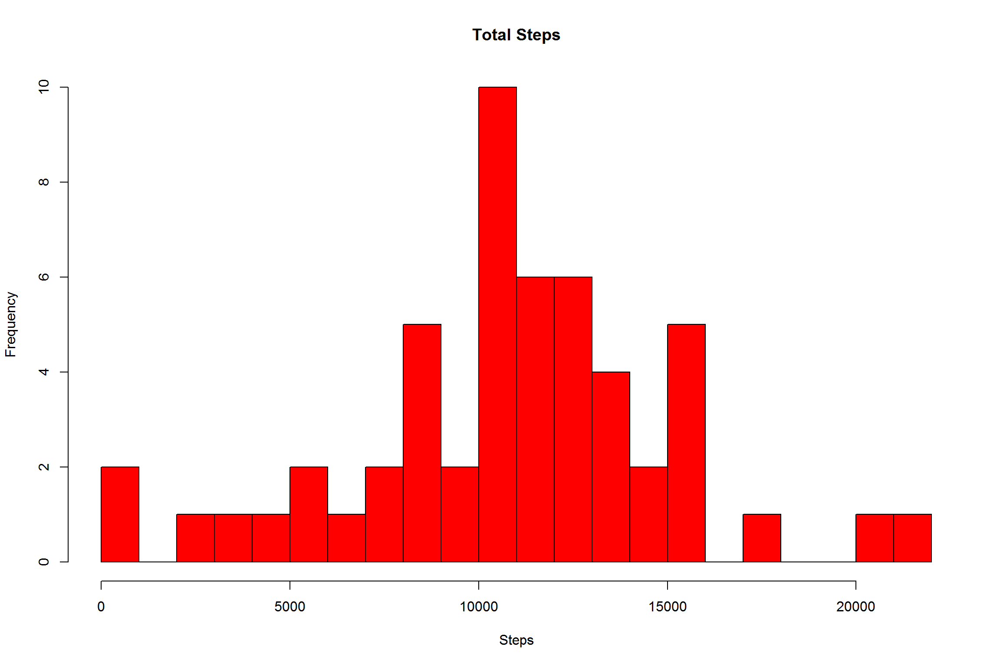
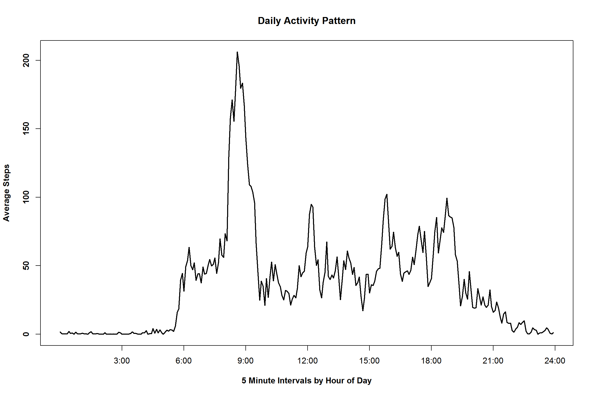
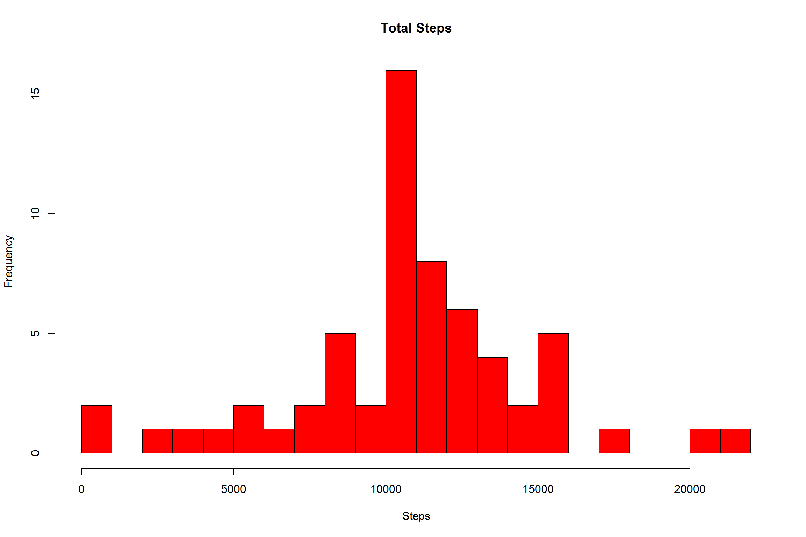
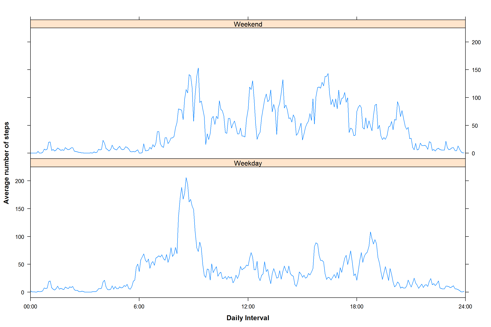

Setting the global options for this document.  


```r
knitr::opts_chunk$set(fig.width=12, fig.height=8, fig.path='Figs/',
                      echo=TRUE, warning=FALSE, message=FALSE)
```
##Response
This submission is in response to Project 1 of the Reproducible Research module.
The data is as described in the README on this fork (https://github.com/rdpeng/RepData_PeerAssessment1).  

The source of the dataset is:  
https://d396qusza40orc.cloudfront.net/repdata%2Fdata%2Factivity.zip  
or it can be sourced from R.D.Peng's Git hub account:<br/>
http://github.com/rdpeng/RepData_PeerAssessment1.

The file can be downloaded and unzipped using the following commands by removing the #'s:

```r
#library(downloader)
#download("https://d396qusza40orc.cloudfront.net/repdata%2Fdata%2Factivity.zip" , #dest="act.zip") 
#unzip ("act.zip")
```
This will create a file named repdata_data_activity, within which there will be a file named activity.csv.  

For this script to run the working directory must be set as the directory containing this file.

From the original README

'This assignment makes use of data from a personal activity monitoring device. This device collects data at 5 minute intervals through out the day. The data consists of two months of data from an anonymous individual collected during the months of October and November, 2012 and include the number of steps taken in 5 minute intervals each day.  

####Data
The variables included in this dataset are:

steps: Number of steps taking in a 5-minute interval (missing values are coded as NA)
date: The date on which the measurement was taken in YYYY-MM-DD format
interval: Identifier for the 5-minute interval in which measurement was taken

The dataset is stored in a comma-separated-value (CSV) file and there are a total of 17,568 observations in this dataset.'

###Requirements  

####Loading and pre-processing the data  
The file can be read in using:


```r
a<-getwd()
setwd(a)
library(dplyr)
library(reshape2)
library(lattice)
library(latticeExtra)
library("miscTools")
```


```r
activity1 <- read.csv("activity.csv", stringsAsFactors=FALSE)
View(activity1)
summary(activity1)
```

```
##      steps            date              interval     
##  Min.   :  0.00   Length:17568       Min.   :   0.0  
##  1st Qu.:  0.00   Class :character   1st Qu.: 588.8  
##  Median :  0.00   Mode  :character   Median :1177.5  
##  Mean   : 37.38                      Mean   :1177.5  
##  3rd Qu.: 12.00                      3rd Qu.:1766.2  
##  Max.   :806.00                      Max.   :2355.0  
##  NA's   :2304
```
We are taking the opportunity to load the required packages and viewing a snapshot of the data.  We will load chron later to avoid conflicts.  If you do not have any of these packages installed, you will need to do so to allow the .Rmd to run.  


The date needs to be converted to Date format to allow correct handling.  

```r
        activity1$date<- as.Date(activity1$date)
```

For this part of the exercise we can ignore NA's.  To allow correct data manipulation the  NA's are removed.  

```r
        activity<- filter(activity1, !is.na(activity1$steps))
```

####Questions  
####1.1 Calculate the total number of steps taken per day.  
This code calculates the steps per day and the total number of steps taken.

```r
        step_day<- activity %>% group_by (date)%>%
        summarise(steps = sum(steps))
        step_day
```

```
## Source: local data frame [53 x 2]
## 
##          date steps
## 1  2012-10-02   126
## 2  2012-10-03 11352
## 3  2012-10-04 12116
## 4  2012-10-05 13294
## 5  2012-10-06 15420
## 6  2012-10-07 11015
## 7  2012-10-09 12811
## 8  2012-10-10  9900
## 9  2012-10-11 10304
## 10 2012-10-12 17382
## ..        ...   ...
```

```r
        sum(step_day$steps)
```

```
## [1] 570608
```
<br>

####1.2. Make a histogram of the total number of steps taken each day
The code to generate that is:


```r
        hist(step_day$steps,xlab="Steps", col="red",breaks=30, main="Total Steps")
```

 

I looked at various different breaks options and felt that 30 gave the best compromise to give a picture of the pattern of the data.  
<br>


####1.3. Calculate and report the mean and median of the total number of steps per day.  

#####Calculate the mean steps per day

```r
        mean(step_day$steps)
```

```
## [1] 10766.19
```
       

######Calculate the median steps per day

```r
        median(step_day$steps)
```

```
## [1] 10765
```
<br>

####2. What is the daily activity pattern.  
The values are split in to 5 minute intervals and the intervals are shown in HH:MM format with a class of character.  If the plot is constructed using the interval as the x axis this will result in a step at the hour interval, for example 50, 55, 100...150, 155, 200.  There are many ways to resolve this step in the data, I have chosen to add an index.  Coursera Discussion Forum is acknowledged as the source of the sequentialperiod code line.


```r
        x<- dcast(activity,...~date, value.var="steps")
        x$sequentialperiod <- seq(0, 1435, by=5) #(1)
        x<-melt(x,id=c("interval", "sequentialperiod")) 
        colnames(x)<- c("interval", "seqp", "date", "steps")   
```

#####Calculate the average daily activity pattern

```r
        daily<- x %>% group_by (seqp, interval)%>%
        summarise(steps = mean(steps))
        daily
```

```
## Source: local data frame [288 x 3]
## Groups: seqp
## 
##    seqp interval     steps
## 1     0        0 1.7169811
## 2     5        5 0.3396226
## 3    10       10 0.1320755
## 4    15       15 0.1509434
## 5    20       20 0.0754717
## 6    25       25 2.0943396
## 7    30       30 0.5283019
## 8    35       35 0.8679245
## 9    40       40 0.0000000
## 10   45       45 1.4716981
## ..  ...      ...       ...
```
<br>

####2.1 Creating and writing a time series plot

```r
plot(daily$seqp,daily$steps, xlab="5 Minute Intervals by Hour of Day", ylab="Average Steps", type="l",lwd=2, font.lab=2, font.axis=2, main="Daily Activity Pattern", xaxt="n")
axis(1, c(180,360,540,720,900,1080,1260,1440), labels = c("3:00","6:00","9:00","12:00","15:00","18:00","21:00","24:00"))
```

 
<br>

####2.2 Identify the interval with the maximum number of steps

```r
        daily[which.max(daily$steps),]
```

```
## Source: local data frame [1 x 3]
## Groups: seqp
## 
##   seqp interval    steps
## 1  515      835 206.1698
```
Therefore the time period with the maximum number of steps is 8:35 am.  
<br>


####3. Imputing missing values  

####3.1 Calculate & report the total number of NA's

```r
        sum(is.na(activity1))
```

```
## [1] 2304
```
This conforms with the summary output we saw at the pre-processing stage above.
<br>

####3.2 Devise a strategy for filling the missing data  
There are several different ways to replace missing data, some being very complex.  We are told that our strategy does not need to be sophisticated.  From investigations, it is probable that this problem is one of the less complex as it involve only one type of data and only the steps type.  It is not always a good idea to impute data as this may create an artificial bias.  On examination we see that there are 7 days where the data is completely absent.  

```r
        q<- dcast(activity1,...~date, value.var="steps")
        q[1:5,2:9]
```

```
##   2012-10-01 2012-10-02 2012-10-03 2012-10-04 2012-10-05 2012-10-06
## 1         NA          0          0         47          0          0
## 2         NA          0          0          0          0          0
## 3         NA          0          0          0          0          0
## 4         NA          0          0          0          0          0
## 5         NA          0          0          0          0          0
##   2012-10-07 2012-10-08
## 1          0         NA
## 2          0         NA
## 3          0         NA
## 4          0         NA
## 5          0         NA
```
<br>

We cannot therefore use any data from the same day.  I looked at simply using the daily mean or median to populate the intervals.  As this created values for intervals where for other days the value was zero (we all must sleep at some time), I felt that this was not the correct approach.  I looked at using packages such as Hmisc and Amelia II.  These either created the linear application of step values or negative values.  I am sure that if I spent some time really understanding these packages I may be able to avoid the pitfalls.  
The logical approach seemed to me to be to use the data from the other days to impute the values into the relevant 5 minute interval on the missing days and I adopted this approach.  
The decision then was what strategy to use to generate that data.  We could use the mean or the median.  I looked at the shape of the data following the use of median and mean.  Using the median appeared to change the shape quite radically and I felt that this was artificially skewing the data.  This comparison is shown below.  
I therefore chose to use the mean value.

<br>


####Calculate the mean of 5 minute intervals and replace NA's with value   

####3.3 Create a new dataset that is equal to the original with the missing data filled in  
<br>

####Reshape the data
Recast the data by interval, calculate the mean for that interval and round the result.  Then replace the missing values and return the data to the 'long' format.  The reshaping has re-ordered the data so this is resorted back to the original format.

####Using the median

```r
        q<- dcast(activity1,...~interval, value.var="steps")
        md<-round(colMedians(q[,-1], na.rm=TRUE), 0)
        q[is.na(q)] <- md
        s<-melt(q, id=c("date")) 
        colnames(s)<- c("date","interval", "steps")   
        s<-arrange(s, date,interval)
```
Check to ensure that all NA's removed.

```r
        sum(is.na(s))
```

```
## [1] 0
```
####Summary of the new dataset

```r
summary(s)
```

```
##       date               interval         steps    
##  Min.   :2012-10-01   0      :   61   Min.   :  0  
##  1st Qu.:2012-10-16   5      :   61   1st Qu.:  0  
##  Median :2012-10-31   10     :   61   Median :  0  
##  Mean   :2012-10-31   15     :   61   Mean   : 33  
##  3rd Qu.:2012-11-15   20     :   61   3rd Qu.:  8  
##  Max.   :2012-11-30   25     :   61   Max.   :806  
##                       (Other):17202
```

```r
length(s$date)
```

```
## [1] 17568
```

####Using the mean


```r
        q<- dcast(activity1,...~interval, value.var="steps")
        mn<-round(colMeans(q[,-1], na.rm=TRUE), 0)
        q[is.na(q)] <- mn
        t<-melt(q, id=c("date")) 
        colnames(t)<- c("date","interval", "steps")   
        t<-arrange(t, date,interval)
```
Check to ensure that all NA's removed.

```r
        sum(is.na(t))
```

```
## [1] 0
```
<br>

####Compare the summary of the new dataset to original
####Original

```r
summary(activity1)
```

```
##      steps             date               interval     
##  Min.   :  0.00   Min.   :2012-10-01   Min.   :   0.0  
##  1st Qu.:  0.00   1st Qu.:2012-10-16   1st Qu.: 588.8  
##  Median :  0.00   Median :2012-10-31   Median :1177.5  
##  Mean   : 37.38   Mean   :2012-10-31   Mean   :1177.5  
##  3rd Qu.: 12.00   3rd Qu.:2012-11-15   3rd Qu.:1766.2  
##  Max.   :806.00   Max.   :2012-11-30   Max.   :2355.0  
##  NA's   :2304
```

####New


```r
summary(t)
```

```
##       date               interval         steps       
##  Min.   :2012-10-01   0      :   61   Min.   :  0.00  
##  1st Qu.:2012-10-16   5      :   61   1st Qu.:  0.00  
##  Median :2012-10-31   10     :   61   Median :  0.00  
##  Mean   :2012-10-31   15     :   61   Mean   : 37.38  
##  3rd Qu.:2012-11-15   20     :   61   3rd Qu.: 27.00  
##  Max.   :2012-11-30   25     :   61   Max.   :806.00  
##                       (Other):17202
```

```r
length(t$date)
```

```
## [1] 17568
```

As can be seen the mean, median and max are unchanged and the number of observations are as originally reported, so no data has been dropped.

<br>

####3.4 Make a histogram of total number of steps

```r
        complete1<- t %>% group_by (date)%>%
        summarise(steps = sum(steps))

hist(complete1$steps,xlab="Steps", col="red",breaks=30, main="Total Steps")
```

 

####3.4.1 Calculate the mean and the median total steps per day    
#####Calculate the mean steps per day

```r
        mean(complete1$steps)
```

```
## [1] 10765.64
```
       

######Calculate the median steps per day

```r
        median(complete1$steps)
```

```
## [1] 10744
```
<br>
The values have changed from the original.  

The overall shape of the data has not changed markedly. It is the peaks in the central areas that have altered.  

As is observed the mean has moved from 10766.19 to 10765.64, the median has moved from 10765 to 10744.  As we have used the mean values, the mean is little changed, the difference is trivial as if both values are rounded they become 10766.  

Overall the median tends to zero so utilising more observations of zero, has unsurprisingly lowered that value.   

The main effect appears to have been that there are more observations around the max value.  The intervals where the steps are between 10000 and 11000 have increased in frequency from 10 to 16 approximately and the interval from 11000 to 12000 from six to seven.  Which makes sense bearing in mind that there are seven missing days and that the larger values would register the greatest effect.  

<br/>


####4. Review of activity by weekday

#####Import package chron to use the is.weekend function.  This package was not imported earlier to avoid system conflicts.  

```r
library(chron)
```
#####Create a new dataset utilising the dataset with replaced NA's

```r
wday<-t
```
####4.1 Create new factor variable split by weekday & weekend

```r
wday$wend<- is.weekend(as.Date(wday$date))
```
######Helper function to convert names

```r
        names<- function(original, changed, z, ...) {
                for(i in 1:length(original))
                       z <- gsub(original[i], changed[i], z, ...)
                z
        }
```
#####Converting names to Weekend & Weekday

```r
d<- c(TRUE, FALSE)
e<- c("Weekend", "Weekday")
wday$wend<- names(d,e, wday$wend)
str(wday)
```

```
## 'data.frame':	17568 obs. of  4 variables:
##  $ date    : Date, format: "2012-10-01" "2012-10-01" ...
##  $ interval: Factor w/ 288 levels "0","5","10","15",..: 1 2 3 4 5 6 7 8 9 10 ...
##  $ steps   : num  2 0 0 0 0 0 1 3 3 31 ...
##  $ wend    : chr  "Weekday" "Weekday" "Weekday" "Weekday" ...
```

```r
sum(wday$wend=="Weekend")
```

```
## [1] 4608
```

```r
sum(wday$wend=="Weekday")
```

```
## [1] 12960
```

<br/>

####4.2 Make a panel plot of time series plot of the 5 minute intervals split by weekend and weekday  

<br/>

#####Grouping and calculating mean values  

Again inserting an index to allow graphing without the steps.

```r
days_steps<- wday%>% group_by (interval,wend)%>%
        summarise(steps = mean(steps))
days_steps1<- subset(days_steps, wend=="Weekday")
days_steps1$seqp<- seq(0, 1435, by=5)
days_steps2<- subset(days_steps, wend=="Weekend")
days_steps2$seqp<- seq(0, 1435, by=5)
```

######Generating and writing graphs  


```r
#setting the x axis scale
xpos<-seq(from=0, by=360, to=1440)
xtabs <- c("00:00","6:00","12:00","18:00","24:00")

#generate the plots
update(c(xyplot(steps~seqp |wend, data=days_steps1, 
                type="l", xlim=c(0,1440),ylim=c(-10,225), xlab=list("Daily Interval", font=2), ylab=list("Average number of steps", font=2)),
                xyplot(steps~seqp |wend, data=days_steps2, 
                type="l", xlim=c(0,1440),ylim=c(-10,225),
                xlab=list("Daily Interval", font=2), ylab=list("Average number of steps", font=2)), 
                layout=c(1,2)), 
                scales = list(x=list(at=xpos, labels=xtabs)))
```

 

<br/>
There is a difference in the patterns of weekends and weekdays.  
We do not know from the data whether the readings are from one person or a group.  I will assume that it is from an individual.  

During the week this person appears to rise about 5.45 and arrive at work shortly before 9am.  Lunch is around noon.  Their departure must vary by day as we see peaks around 4pm, 5pm and 6.30.  Retiring on average around 11pm.  The timings and activity pattern would tend to suggest a mainly sedentary office worker who is likely to live fairly near their place of work and walk there.  This is deduced from the lack of   an extended period of zero activity from rising to arriving at work, to accommodate travelling by say bus or train.  They must also be fairly organised,allowing sufficient journey time, or live in a city as the peak implied walking speed is 1.4 mph which could hardly be described as brisk. (206 yards/5minutes)  The average human walking pace is about 3.1 mph.(2)  I am assuming that a stride is 1 yard long, which is generous as the average stride length is about 2.5 feet.(3)  

At weekends they rise later and have a lower peak activity.  Activity is spread across the day, rather than being peaked at certain times and there is a sustained period of activity during the afternoon.  The steps per interval are roughly in the range of 50-100, peaking at a little more than 150, so walking speeds of around .35 mph to .7mph with a peak of 1 mph.  So it is likely that they spend their weekends taking some light activity which would probably include shopping.  They tend to return home a little later but would seem to retire at about the same time.  I am somewhat sceptical of the blip from about 1am to 3am shown on both Weekdays and Weekends.  This is not present on the cleaned data and I suspect is noise induced by imputing the missing values.  


```r
summary(days_steps1)#Weekday
```

```
##     interval       wend               steps                seqp       
##  0      :  1   Length:288         Min.   :  0.02222   Min.   :   0.0  
##  5      :  1   Class :character   1st Qu.:  9.40000   1st Qu.: 358.8  
##  10     :  1   Mode  :character   Median : 26.46667   Median : 717.5  
##  15     :  1                      Mean   : 35.52377   Mean   : 717.5  
##  20     :  1                      3rd Qu.: 50.07222   3rd Qu.:1076.2  
##  25     :  1                      Max.   :205.80000   Max.   :1435.0  
##  (Other):282
```

```r
sum((days_steps1$steps))
```

```
## [1] 10230.84
```

```r
summary(days_steps2)#Weekend
```

```
##     interval       wend               steps              seqp       
##  0      :  1   Length:288         Min.   :  0.000   Min.   :   0.0  
##  5      :  1   Class :character   1st Qu.:  7.234   1st Qu.: 358.8  
##  10     :  1   Mode  :character   Median : 31.969   Median : 717.5  
##  15     :  1                      Mean   : 42.603   Mean   : 717.5  
##  20     :  1                      3rd Qu.: 69.625   3rd Qu.:1076.2  
##  25     :  1                      Max.   :153.125   Max.   :1435.0  
##  (Other):282
```

```r
sum((days_steps2$steps))
```

```
## [1] 12269.75
```
This shows that on average a greater level of activity at the weekend when they walk farther, a distance of 6.97 miles as opposed to 5.81 miles during the week, but, as we have seen, a lower peak value.
  
<br/>


#####**Setup**
Windows 7  
Intel i5  
RStudio Version 0.98.1091  

#####References  
(1) Coursera Discussion Forum  
(2)http://en.wikipedia.org/wiki/Walking
(3) http://www.thewalkingsite.com/10000steps.html
